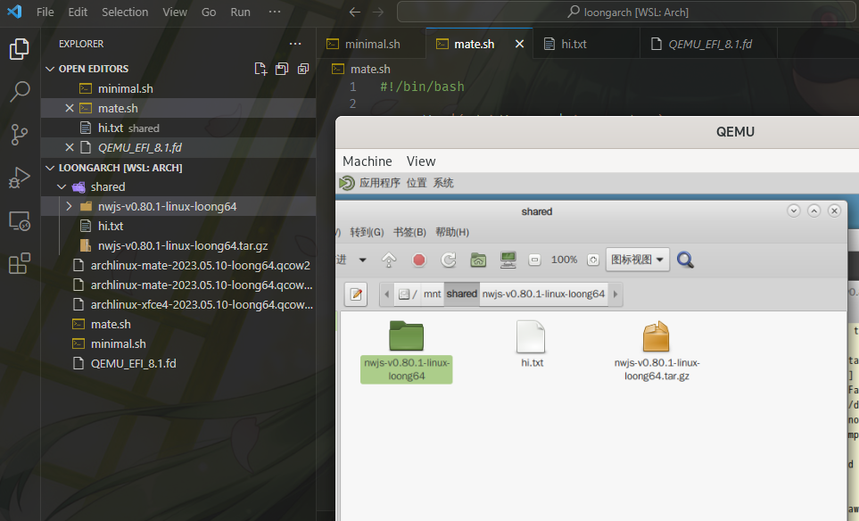
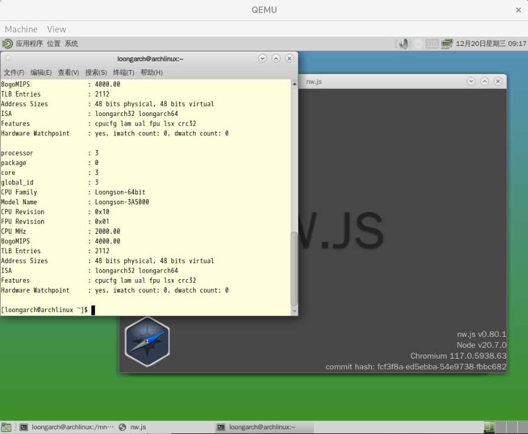

## 前言

没有Loongarch硬件环境，但是想要编译运行软件进行体验。

## qemu指引

下载就能用：[https://loongarchlinux.org/pages/vmrun/](https://loongarchlinux.org/pages/vmrun/)

## 共享文件夹

在宿主编译程序后想在qemu中运行。

### From ChatGPT

使用QEMU的`-virtfs`选项创建一个共享文件夹。这将允许您在宿主机和QEMU虚拟机之间共享文件。以下是如何设置共享文件夹的示例：

```
qemu-system-x86_64 -m 512 -hda my_disk_image.img -virtfs local,path=/path/to/shared/folder,mount_tag=host0,security_model=passthrough,id=host0
```

在QEMU虚拟机中，您需要挂载共享文件夹。对于Linux系统，您可以使用以下命令：

```
sudo mkdir /mnt/shared
sudo mount -t 9p -o trans=virtio,version=9p2000.L host0 /mnt/shared
```

现在，您可以在`/mnt/shared`目录中访问宿主机上的共享文件夹。



## nw.js v0.80.1

